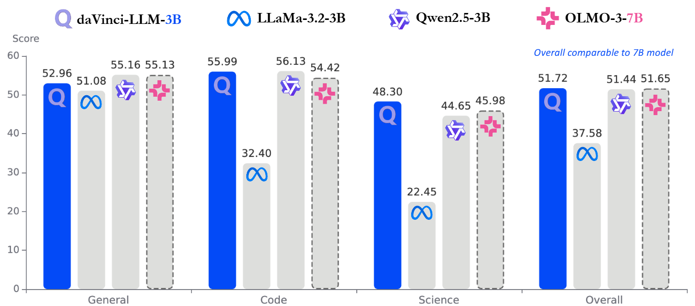

# daVinci-LLM: Towards the Science of Pretraining

<div align="center">

[](https://github.com/GAIR-NLP/daVinci-LLM/blob/main/report.pdf)
[](https://huggingface.co/datasets/SII-GAIR-NLP/davinci-llm-data)
[](https://huggingface.co/SII-GAIR-NLP/davinci-llm-model)

</div>


## 🔬 Why This Project Matters

**Open-source ≠ Transparent: We can download model weights, but we cannot see the scientific process that shaped them.**

<div align="center">
  
</div>

The LLM ecosystem has evolved into a stratified landscape. At the most opaque tier lie closed-source commercial models (GPT, Claude, Gemini) accessible only through APIs. The intermediate tier comprises open-weight models (LLaMA, Qwen, DeepSeek) that release checkpoints but withhold critical pretraining details—data compositions, mixture ratios, and training dynamics remain largely undisclosed. This creates a fundamental paradox: precisely when emerging evidence demonstrates that pretraining choices fundamentally shape downstream capabilities, the community has limited ability to systematically investigate the principles governing how models acquire and organize knowledge during pretraining.

Pretraining determines a model's capability ceiling; post-training can refine and align model behavior but cannot transcend the knowledge boundaries, reasoning patterns, and compositional structures established during pretraining.

**daVinci-LLM**, developed by the **GAIR-NLP group at Shanghai Innovation Institute (SII)**, addresses this gap directly. We adopt a fully-open paradigm that treats openness itself as scientific methodology—releasing not only model weights, but **200+ controlled ablation results**, complete data processing pipelines, training decision logic, and even the failed attempts. This enables the community to understand *why* the model was trained this way, not merely *what* it produced.


## 🎁 Open-Source Artifacts

We publicly release the following artifacts to facilitate reproducibility and support the research community:

| Category | Content |
|----------|---------|
| 🤗 **Model Weights** | Final model and all intermediate checkpoints (saved every 5,000 steps) |
| 📁 **Datasets** | Self-processed Darwin-Science corpus, synthesized QA pairs, and all pipeline outputs |
| 🔧 **Data Processing Toolkit** | Complete prompts for generative refinement and cognitive completion; filtering, deduplication, and synthesis code |
| 📈 **Training Logs** | Complete training trajectories, hyperparameter configurations, and data mixture evolution across stages |
| ✅ **Evaluation Suite** | All 19 benchmark configurations and scoring code |
| 📄 **Technical Report** | Complete decision-making logic with 200+ ablation results, including negative results |

### Transparency Comparison

| Dimension | Llama 3 | Qwen 3 | YuLan | OLMo 3 | **daVinci** |
|-----------|:-------:|:------:|:-----:|:------:|:-----------:|
| Model Weights | ✅ | ✅ | ✅ | ✅ | ✅ |
| Training Code | ❌ | ❌ | ✅ | ✅ | ✅ |
| Training Logs | ❌ | ❌ | ❌ | ✅ | ✅ |
| Intermediate Checkpoints | ❌ | ❌ | ❌ | ✅ | ✅ |
| Full Training Data | ❌ | ❌ | Partial | ✅ | ✅ |
| **Processing Methodology** | ❌ | ❌ | ❌ | ❌ | **✅** (L0–L9) |
| **Mixture Rationale** | ❌ | ❌ | ❌ | Partial | **✅** |
| **Decision Transparency** | ❌ | ❌ | ❌ | Partial | **✅** |
| **Negative Results** | ❌ | ❌ | ❌ | ❌ | **✅** |


## 🏛️ Three Pillars of Full Openness

daVinci-LLM is structured around three pillars, each contributing to transparency and reproducibility:

### 1. 📊 Data Transparency — The Data Darwinism Framework

> *Data processing depth is a key optimization dimension on par with data scale.*

We adopt the **Data Darwinism framework**, a principled **L0–L9 taxonomy** that organizes data processing operations from basic acquisition to full synthesis, following a coherent evolutionary logic: from selecting and preserving existing content, progressively toward active rewriting and enrichment, and ultimately reaching the capacity to synthesize entirely new content from scratch.

<div align="center">
  
</div>

| Level | Name | Description |
|-------|------|-------------|
| **L0** | Data Acquisition | Raw data collected from web crawls, code platforms, document repositories |
| **L1** | Format Normalization | Converting heterogeneous formats (HTML, PDF) into unified text representations |
| **L2** | Rule-based Filtering | Deterministic rules to remove near-duplicates, malformed text, non-target languages |
| **L3** | Lightweight Model Filtering | Lightweight classifiers for educational value scoring and domain identification |
| **L4** | Generative Refinement | LLM-driven content transformation — removing structural noise, repairing fragments, strictly preserving semantics |
| **L5** | Cognitive Completion | Frontier LLMs make implicit reasoning explicit, expanding compressed logical steps into full derivations |
| **L6–L9** | Higher-Order Synthesis | Contextual completion, environment synthesis, ecosystem synthesis, world synthesis (theoretical frontier) |

Our **7.5T+ token training corpus is fully traceable**: every data source is explicitly annotated with its Darwin Level, making curation decisions systematic and transparent. Researchers can clearly see what processing depth each data type has reached and whether further enhancement is worthwhile.

### 2. 🎓 Training Transparency — Adaptive Two-Stage Curriculum

> *Effective pretraining demands stage-specific data strategies guided by capability dynamics.*

<div align="center">
  
</div>

Unlike fixed-recipe training, daVinci-LLM employs a **dynamically monitored, adaptively adjusted strategy** that evolves with the model's maturing capabilities:

**Stage 1 (6T tokens): General Foundation Pretraining**
- Evaluating all 19 benchmarks every 5,000 steps to track capability development in real time
- **Key finding**: Different capabilities exhibit vastly different saturation timescales — general knowledge benchmarks plateau within the first 1T tokens, while code and science reasoning sustain consistent growth beyond 4T tokens
- Based on this, Stage 1-2 substantially increases code and science data proportions, reallocating compute toward capabilities that are still actively learning

**Stage 2 (2T tokens): Reasoning Capability Enhancement**
- Finding that domain proportion adjustment alone can no longer sustain continuous growth in reasoning capabilities, Stage 2 introduces a new data format: **large-scale structured QA data**
- *Stage 2-1 (1T tokens)*: Balanced introduction — QA, code, and science data at 30% each, with 10% high-quality web text, preventing catastrophic forgetting while establishing reasoning foundations
- *Stage 2-2 (1T tokens)*: Intensified enhancement — QA concentration raised to 70%, leveraging the stable foundation from Stage 2-1 for targeted reasoning amplification

Training trajectories demonstrate that Stage 2 achieves +12.14 overall improvement from Stage 1 (39.58 → 51.72), enabling the 3B model to match 7B-scale OLMo-3.

### 3. 🧪 Scientific Transparency — 200+ Controlled Ablations

> *Pretraining is full of "plausible-sounding" assumptions. Systematic ablation experiments reveal that many intuitions can be overturned.*

Through over **200 controlled experiments**, we systematically investigate four thematic areas:

<details>
<summary><b>📌 Data Processing Depth: From Filtering to Synthesis</b></summary>

- **L3 model-based filtering** yields notable gains on foundational programming tasks (MBPP **+3.40**) but limited improvements on high-order tasks, suggesting that filtering alone is insufficient to unlock the full potential of code training data
- **L4 generative refinement** delivers substantial improvements for complex reasoning — MATH **+7.00** vs. only +1.37 on simple word problems, demonstrating the asymmetric value of structural purification for multi-step reasoning
- **L5 cognitive completion** exhibits strong domain-specific alignment: QA synthesized from code sources enhances programming but does not transfer to science domains, and vice versa — positioning L5 as a high-precision tool for capability steering
- **Core insight**: For reasoning-intensive tasks, advancing processing depth often outweighs simply expanding data volume

</details>

<details>
<summary><b>📌 Training Dynamics: Adaptive Data Strategies</b></summary>

- Different capabilities saturate at dramatically different rates — general knowledge plateaus at ~1T tokens, while code and science reasoning continue growing beyond 4T tokens
- Domain proportion adjustments encounter fundamental limitations once standard corpus formats collectively approach saturation; at that point, reallocating among these formats no longer suffices
- The transition to structured QA in Stage 2 substantially outperforms continued domain proportion adjustment (Stage 1-3)
- **Core insight**: Sustained capability development requires monitoring convergence patterns and adapting both domain proportions *and* data formats across training

</details>

<details>
<summary><b>📌 Data Mixture Design: Balancing Intensification and Preservation</b></summary>

- Balanced configurations (30/30/30 mixture) outperform extreme specialization; different domains exhibit synergistic effects within moderate ranges but antagonistic effects beyond thresholds
- Direct high-concentration training triggers capability collapse, whereas first establishing balanced representations and then progressively intensifying achieves aggressive enhancement while preserving general competence
- Stage 2-1's conservative 30% QA is essential: 70% QA in Stage 2-1 triggers code performance collapse due to insufficient code QA diversity, but 70% QA in Stage 2-2 improves all domains monotonically after a balanced foundation is established
- **Core insight**: Through strategic mixture design and progressive intensification, it is possible to escape the false dichotomy between generalization and specialization

</details>

<details>
<summary><b>📌 Evaluation Validity: PPL-based vs. Generative-based</b></summary>

- The choice between PPL-based and generative evaluation is not merely technical — these protocols probe different aspects of model capability, and models with extensive QA pretraining can exhibit **ranking reversals** across them
- Example: OLMO-2-7B slightly outperforms Qwen-2.5-3B under PPL-based evaluation, but the ranking reverses under generative evaluation — a 3.10% swing that reveals genuine differences in pretraining data composition
- **Core insight**: Evaluation methodology itself must be questioned and validated. When a metric behaves anomalously, both the model and the evaluation protocol should be scrutinized; reporting both protocols provides a more complete capability profile

</details>


## 📊 Key Results: 3B Matches 7B

> *The 3B model outperforming 7B is not a lucky outcome of "alchemy" — it is the inevitable result of a scientific approach: when data processing, training dynamics, and mixture strategies are all empirically validated, limited parameters can unleash outsized capabilities.*

Our **daVinci-LLM-3B** (trained from random initialization over 8T tokens) achieves an **overall average of 51.72, matching OLMo-3 7B (51.65)** in comprehensive evaluation despite having less than half the parameters, and significantly outperforming parameter-matched baselines such as LLaMA-3.2-3B.


### Comprehensive Benchmark Results (19 Benchmarks)

| Domain | Benchmark | **daVinci-3B** | OLMo-3 7B | OLMo-2 7B | Yulan 2.4B | LLaMA-3.2 3B | Qwen-2.5 3B |
|--------|-----------|:--------------:|:---------:|:---------:|:----------:|:------------:|:-----------:|
| **General** | MMLU | 62.53 | 66.53 | 65.93 | 50.70 | 54.91 | 65.73 |
| | MMLU-Pro | **43.50** | 35.70 | 28.40 | 23.90 | 24.50 | 39.00 |
| | AGIEval | 26.77 | 33.75 | 31.78 | 28.22 | 22.72 | 37.15 |
| | HellaSwag | 71.17 | 74.15 | 80.50 | 68.56 | 73.60 | 73.60 |
| | TriviaQA | 49.90 | 55.45 | 68.01 | 27.64 | 55.22 | 51.20 |
| | RACE | 38.56 | 40.57 | 40.96 | 35.69 | 38.95 | 38.47 |
| | WinoGrande | 66.77 | 69.61 | 74.59 | 66.69 | 69.22 | 68.59 |
| | OpenBookQA | 40.20 | 41.80 | 47.60 | 43.00 | 43.00 | 43.80 |
| | PIQA | 77.26 | 78.62 | 81.07 | 76.22 | 77.58 | 78.89 |
| | *Avg General* | *52.96* | *55.13* | *57.65* | *46.74* | *51.08* | *55.16* |
| **Code** | HumanEval | **61.64** | 59.05 | 16.78 | 66.77 | 33.17 | 60.17 |
| | EvalPlus | **57.32** | 53.62 | 13.85 | 62.25 | 27.22 | 53.23 |
| | MBPP | 49.00 | 50.60 | 23.20 | 52.00 | 36.80 | 55.00 |
| | *Avg Code* | ***55.99*** | *54.42* | *17.94* | *60.34* | *32.40* | *56.13* |
| **Science** | GSM8K | 72.86 | 76.80 | 67.32 | 66.79 | 29.72 | 75.36 |
| | GSM-Plus | 50.38 | 51.58 | 44.58 | 43.71 | 16.12 | 51.21 |
| | MATH | **62.80** | 39.60 | 17.80 | 29.40 | 9.00 | 37.20 |
| | GPQA-Main | 32.37 | 37.05 | 30.80 | 29.91 | 29.46 | 31.47 |
| | SuperGPQA | 19.56 | 21.84 | 1.67 | 15.53 | 3.18 | 18.40 |
| | MMLU-STEM | 53.41 | 60.20 | 53.63 | 44.12 | 47.64 | 61.91 |
| | MMLU-Pro-STEM | **46.70** | 34.77 | 23.77 | 20.52 | 22.03 | 37.00 |
| | *Avg Science* | ***48.30*** | *45.98* | *34.22* | *35.71* | *22.45* | *44.65* |
| | **Overall** | **51.72** | **51.65** | 42.75 | 44.82 | 37.58 | 51.44 |

Particularly noteworthy is the MATH benchmark performance: **daVinci-3B achieves 62.80, far exceeding 7B-scale OLMo-3 (39.60)** and all parameter-matched baselines. This significant gap is not attributable to raw compute but is a direct product of scientific pretraining exploration:
- L4/L5 data processing transforms disorganized mathematical text into logically structured derivations, reducing the difficulty of extracting fundamental patterns
- Adaptive training dynamics reallocate compute toward reasoning dimensions upon detecting general knowledge saturation
- Two-stage QA intensification achieves targeted enhancement on a balanced foundation, avoiding capability imbalance from unidimensional training


## 🌟 Contributions to the Community

1. **Complete Research Materials**: We release model weights, all intermediate checkpoints, data processing pipelines, and self-produced datasets. These artifacts enable researchers to deeply analyze when capabilities emerge, reproduce the complete training process, or conduct extended investigations building upon our work.

2. **Question-Driven Pretraining Science**: By transforming key pretraining decisions into systematically verifiable research questions, we provide empirical understanding of data quality, training dynamics, and mixture strategies. Other researchers facing similar decisions can make more informed choices based on our empirical evidence, rather than relying on heuristics or intuition.

3. **Transferable Methodological Foundations**: The Data Darwinism framework, systematic exploration methodology, and complete documentation of successes and failures constitute reusable research infrastructure. Researchers can apply this system to evaluate their own data and strategies, building on documented boundary conditions without retracing the same missteps — forming the foundation of an accumulative scientific knowledge base for pretraining.


## 🚀 Quick Start

```bash
# Clone the repository
git clone https://github.com/GAIR-NLP/daVinci-LLM.git
cd daVinci-LLM
```

Model and dataset are available on HuggingFace:
- **Model**: [SII-GAIR-NLP/davinci-llm-model](https://huggingface.co/SII-GAIR-NLP/davinci-llm-model)
- **Dataset**: [SII-GAIR-NLP/davinci-llm-data](https://huggingface.co/datasets/SII-GAIR-NLP/davinci-llm-data)

For detailed usage instructions and evaluation setup, please refer to the [Technical Report](https://github.com/GAIR-NLP/daVinci-LLM/blob/main/report.pdf).


## 🔮 Future Directions

The science of pretraining has only just begun.

Does the model truly "understand" the task, or has it merely memorized patterns? Why is generalization so fragile? Where are the capability boundaries of pretraining? These fundamental questions about the nature of learning still lack systematic scientific investigation.

daVinci-LLM takes a step toward making the exploration process transparent. But establishing a true science of pretraining requires open collaboration from the entire community — when exploration processes become the norm and empirical knowledge accumulates, pretraining can genuinely transition from "black-box alchemy" to a scientific discipline.


## 📚 Citation

Citation will be provided once the paper is publicly available.
