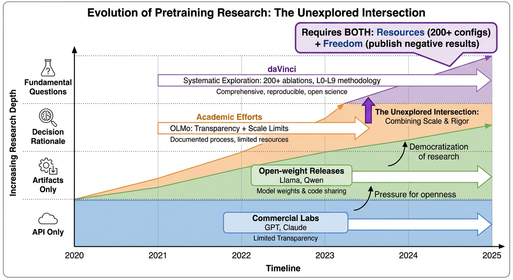
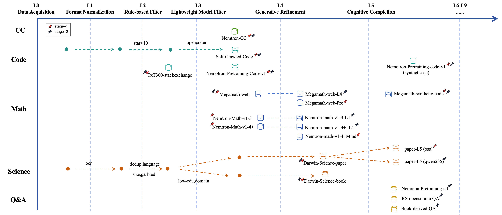
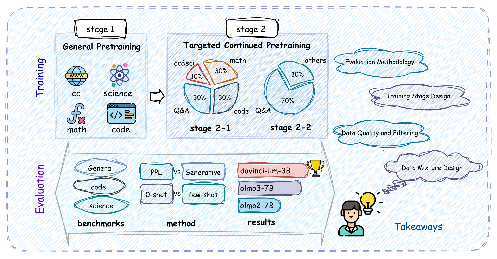

# daVinci-LLM: Towards the Science of Pretraining

## 📖 Overview

daVinci-LLM is a fully-open pretraining research project by GAIR-NLP that aims to turn pretraining into a **scientific, question-driven process**. Instead of only releasing final checkpoints, we document data decisions, training dynamics, and negative results to enable reproducibility and systematic understanding.

  

## ✨ Paper Highlights

- **Data Darwinism (L0–L9):** a principled taxonomy for data processing depth, from acquisition and filtering to generative refinement and cognitive completion.  
- **Two-stage pretraining curriculum (8T tokens):** Stage 1 (6T) builds general foundations; Stage 2 (2T) shifts to reasoning-intensive mixtures with structured QA.  
- **200+ controlled ablations:** evidence-driven decisions on data processing depth, mixture ratios, and training dynamics; negative results included for transparency.  
- **Reasoning gains from quality, not just scale:** L4/L5 processing delivers material gains on reasoning benchmarks and can substitute for raw data scaling.  
- **Open scientific process:** complete artifacts planned—datasets, checkpoints, logs, and evaluation suites—for end-to-end reproducibility.

  

## 📊 Key Results

We train a 3B-parameter model from random initialization across **8T tokens** using a **two-stage curriculum**: Stage 1 (6T) builds broad foundations with progressive data adjustment, while Stage 2 (2T) shifts to reasoning-intensive enhancement by introducing large-scale structured QA alongside code and science.

  

- **Overall average: 51.72** for **daVinci-LLM-3B**, matching **OLMo-3 7B (51.65)** despite less than half the parameters.  
- **MATH: 62.80** for daVinci-LLM-3B, with strong gains in science reasoning.  
- Evaluated across **19 benchmarks** covering General, Code, and Science domains.

  

## 📚 Citation

Citation will be provided once the paper is publicly available.

---

